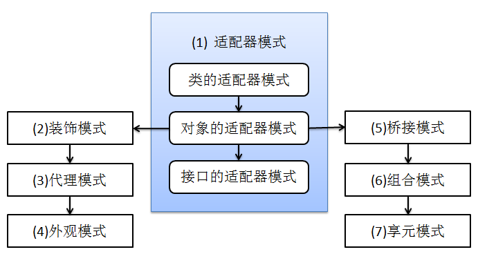

## 适配器模式（Adapter）  

结构型模式：适配器模式、装饰模式、代理模式、外观模式、桥接模式、组合模式、享元模式。其中对象的适配器模式是各种结构型模式的起源。  

  


适配器模式将某个类的接口转换成客户端期望的另一个接口表示，目的是消除由于接口不匹配所造成的类的兼容性问题。主要分为三类：类的适配器模式、对象的适配器模式、接口的适配器模式。  

**类适配器模式**  

涉及的角色有：  

1. **Adapee** ：源角色，现在需要适配的类。  
2. **Target** : 目标角色，这就是所期待得到的接口。注意：由于这里讨论的是类适配器模式，因此目标不可以是类。  
3. **Adaper** ：适配器角色，适配器类是本模式的核心。适配器把源类转换成目标接口。显然，这一角色不可以是接口，而必须是具体类。  
 
```java
/** 
 * The Apache License 2.0
 * Copyright (c) 2018 sep6th
 */

class Adapee {

    public void two(){
	System.out.println("两孔");
    }
	
}

interface Target {
	
    void two();
    void three();
	
}

public class Adaper extends Adapee implements Target {

    @Override
    public void three() {
	System.out.println("三孔");
    }
	
    public static void main(String[] args) {
		
	Adaper adaper = new Adaper();
	adaper.two();
	adaper.three();
		
    }
	
}
```

**对象适配器模式**  

基本思路和类的适配器模式相同，只是将Adapter类作修改，这次不继承Adapee类，而是持有Adapee类的实例，以达到解决兼容性的问题。

修改Adapter  

```java
public class Adaper implements Target {

    Adapee adapee;
	
    public Adaper(Adapee adapee) {
	this.adapee = adapee;
    }
	
    @Override
    public void three() {
	System.out.println("三孔");
    }
	
    @Override
    public void two() {
	adapee.two();
    }
	
    public static void main(String[] args) {
		
	Adaper adaper = new Adaper(new Adapee());
	adaper.two();
	adaper.three();
		
    }
	
}
```

**接口适配器模式**  

借助于一个抽象类，该抽象类去实现接口，实现了所有的方法，而我们不和原始的接口打交道，只和该抽象类取得联系，所以我们写一个类，继承该抽象类，重写我们需要的方法就行。

```java
/** 
 * The Apache License 2.0
 * Copyright (c) 2018 sep6th
 */

interface IBase {
	
    void one();
    void two();
    void three();
	
}

abstract class Base implements IBase {
	
    @Override
    public void one() {}

    @Override
    public void two() {}

    @Override
    public void three() {}
	
}


public class Adaper extends Base {

    @Override
    public void three() {
        System.out.println("这才是我想要的！");
    }

    public static void main(String[] args) {
        Adaper adaper = new Adaper();
        adaper.three();
    }
	
}
```

**总结**  

类适配器模式：当希望将一个类转换成满足另一个新接口的类时，可以使用类的适配器模式，创建一个新类，继承原有的类，实现新的接口即可。  

对象适配器模式：当希望将一个对象转换成满足另一个新接口的对象时，可以创建一个Adaper类，持有原类的一个实例，在Adaper类的方法中，调用实例的方法就行。  

接口适配器模式：当不希望实现一个接口中所有的方法时，可以创建一个抽象类，实现所有方法，我们再写实现类的时候，继承抽象类即可。

