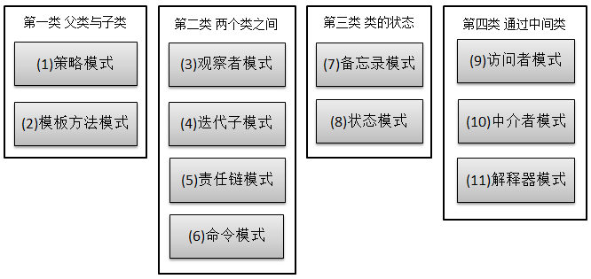

## 策略模式（strategy）

行为型模式，共11种：策略模式、模板方法模式、观察者模式、迭代子模式、责任链模式、命令模式、备忘录模式、状态模式、访问者模式、中介者模式、解释器模式。  

关系图：  

   

策略模式属于对象的行为模式。其用意是针对一组算法，将每一个算法封装到具有共同接口的独立的类中，从而使得它们可以相互替换。策略模式使得算法可以在不影响到客户端的情况下发生变化。  

**优点**  

1. 策略模式提供了管理相关的算法族的办法。策略类的等级结构定义了一个算法或行为族。恰当使用继承可以把公共的代码移到父类里面，从而避免代码重复。  

2. 使用策略模式可以避免使用多重条件(if-else)语句。多重条件语句不易维护，它把采取哪一种算法或采取哪一种行为的逻辑与算法或行为的逻辑混合在一起，统统列在一个多重条件语句里面，比使用继承的办法还要原始和落后。  

**缺点**

1. 客户端必须知道所有的策略类，并自行决定使用哪一个策略类。这就意味着客户端必须理解这些算法的区别，以便适时选择恰当的算法类。换言之，策略模式只适用于客户端知道算法或行为的情况。  

2. 由于策略模式把每个具体的策略实现都单独封装成为类，如果备选的策略很多的话，那么对象的数目就会很可观。  

eg.计算器  


```java
/** 
 * The Apache License 2.0
 * Copyright (c) 2018 sep6th
 */

public interface ICalculator {
	
    int calculate(int param1, int param2);
	
}
```

```java
/** 
 * The Apache License 2.0
 * Copyright (c) 2018 sep6th
 */
class Plus implements ICalculator {

    @Override
    public int calculate(int param1, int param2) {
	return param1 + param2;
    }

}

class Minus implements ICalculator {

    @Override
    public int calculate(int param1, int param2) {
	return param1 - param2;
    }

}

class Multiply implements ICalculator {

    @Override
    public int calculate(int param1, int param2) {
	return param1 * param2;
    }

}
```

```java
/** 
 * The Apache License 2.0
 * Copyright (c) 2018 sep6th
 */
public class Test {

    public static void main(String[] args) {
	ICalculator calculator = new Plus();
	int result = calculator.calculate(200, 50);
	System.out.println(result);
    }

}
```

